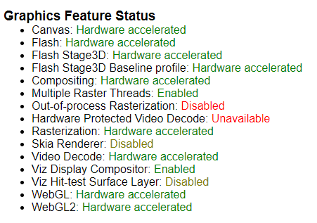
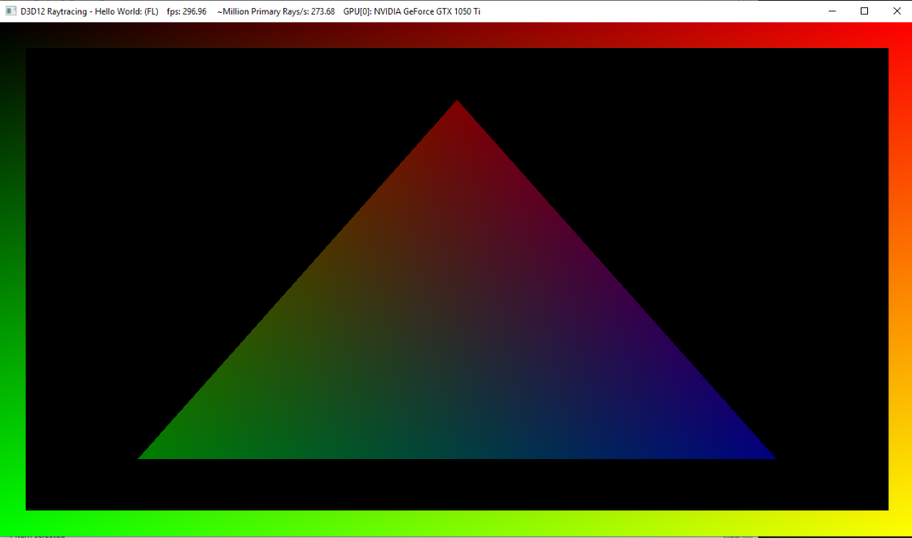
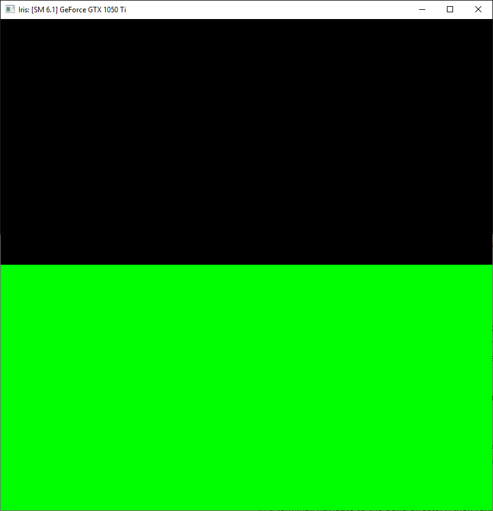
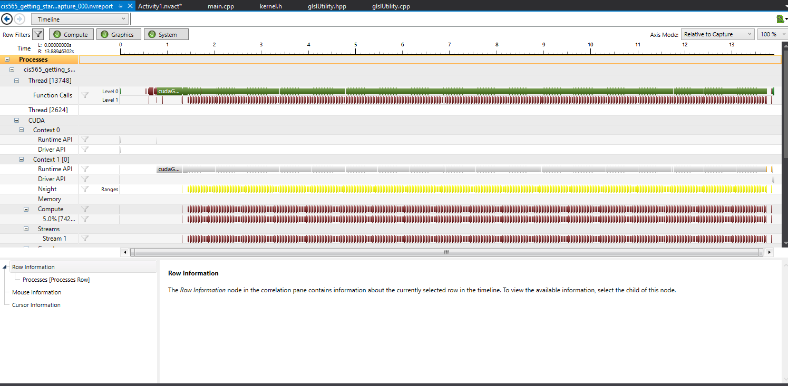
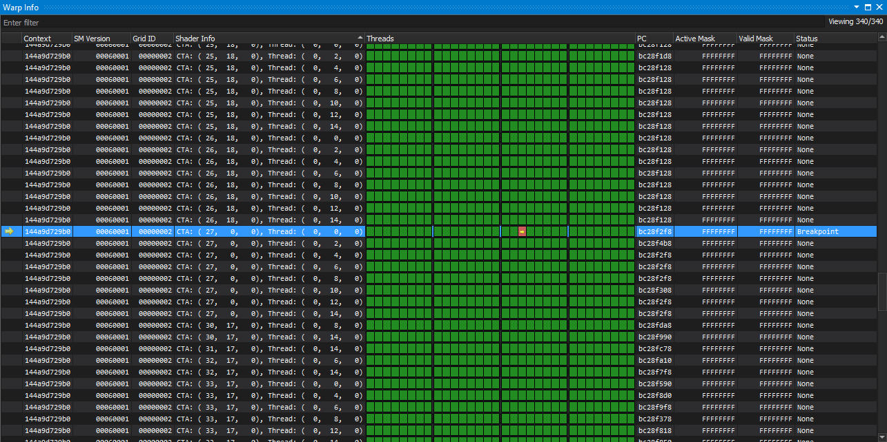

Project 0 Getting Started
====================

**University of Pennsylvania, CIS 565: GPU Programming and Architecture, Project 0**

* Yuan Xiao (Iris)
  
  * [LinkedIn](https://www.linkedin.com/in/yuan-xiao-iris97/)
  
* Tested on:  Windows 10, AMD Ryzen 1200@ 3.10GHz 8GB, GTX 1050 4GB

  

## Screenshots

### Part 2.2: WebGL

### Part 2.3: DXR

### Part 3&4

### Part 5: Analyze

### Part 6: Nsight Debugging

